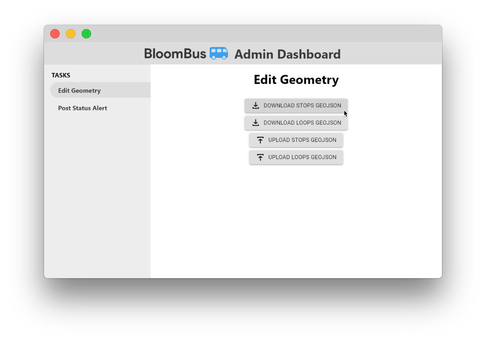
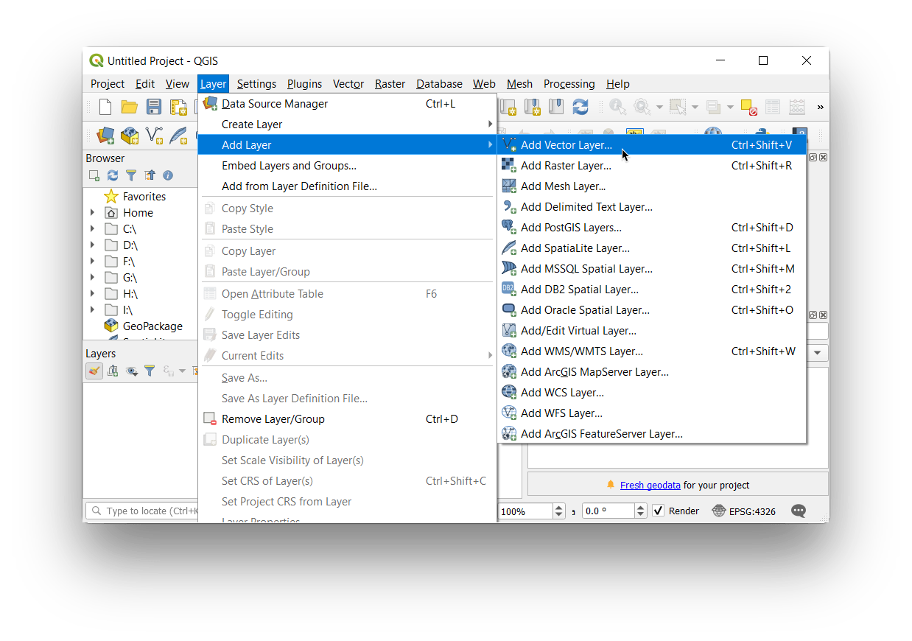
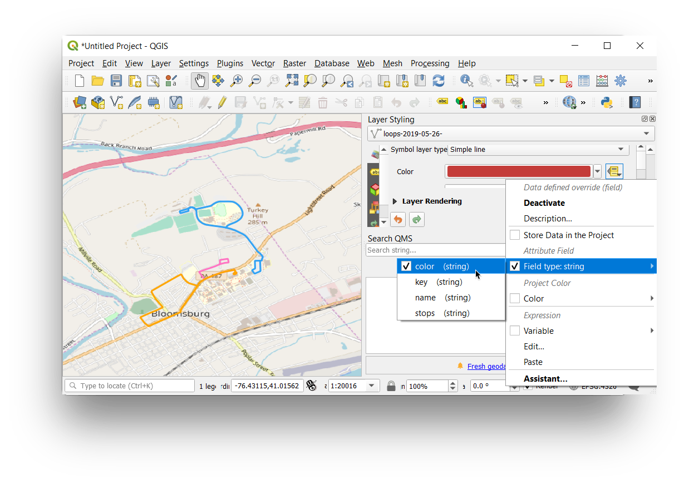

# Editing Geospatial Features

The spatial data for the BloomBus project \(the collections of points, lines and polygons that represent shuttle loops, shuttle stops, etc\) are stored in the Firebase Realtime Database as [GeoJSON](https://geojson.org/), the most popular interchange format for geospatial data, especially over the web. The shuttle loops are kept as a GeoJSON FeatureCollection at the `/shuttles` ref, and under the `/stops` ref there is a collection of keys that correspond to a shuttle stop with it's value being a GeoJSON Feature.

To download the GeoJSON for the shuttle stops or the shuttle loops, go to the admin dashboard served by [BloomBus-Server](bloombus-server/architecture.md), go to the **Edit Geometry** task, and click the corresponding download button.

Once you have downloaded the GeoJSON, you can add the GeoJSON as a vector feature layer in any sufficiently advanced GIS editing software, such as [**QGIS** ](https://www.qgis.org/en/site/)or [**ArcGIS**](https://www.arcgis.com/index.html). QGIS is a free and open source software so this will likely be the more sensible choice for working on editing the geometry from a personal computer, but the licensed ArcGIS platform is more robust if you are able to access the GIS lab in Hartline B14. If you are interested in using ArcGIS and do not know how to use it, see Dr. Brunskill \(really pleasant guy\) whose office is right next door. For this example, we will use QGIS.

Open a new QGIS session and click **Layer &gt; Add Layer &gt; Add Vector Layer...**

In the dialog select the **.geojson** file you downloaded, click **Add**, then **Close**, and the features should be added to the map. If you are adding both the shuttle stops and the shuttle loops, repeat the previous steps. Next, in the **Browser** window on the left, expand **XYZ Tiles** and drag the **OpenStreetMap** layer onto the map to add a basemap layer to see where you are positioning features in space. If the OpenStreetMap layer is not available to you, search online for an alternative raster basemap that at least covers the Bloomsburg area for you to work with \([PASDA](https://www.pasda.psu.edu/uci/SearchResults.aspx?Shortcut=aerial) may be a good resource for this\). Also, **ensure the feature layers you are working on placed above the basemap in the Layers window.**

If you are working on the loops feature layer, it is recommended to classify each loop with different symbology. Under the **Layer Styling** pane on the right, click the **Data defined override** button to the right of the **Color** dropdown. Hover over **Field type** and select **"color"**. Each feature has a "color" field set to a hexadecimal value. This is used to consistently symbolize the feature across BloomBus-Client, BloomBus-Tracker, and any other mapping context. When new features are added, you should select a color value distinct from the others and set it in the feature's attributes table.

To begin editing the line features, click **Toggle Editing**, and then to edit existing line features, use the **Vertex Tool** or use the **Add Line Feature** tool to begin creating new lines.

To open the **attribute table** of a feature layer, right click on the layer in the **Layers** pane, and click **Open Attribute Table.**

When your edits are complete, right click on the layer in the **Layers** pane, then **Export &gt; Save Features As...**  
Change the **Format** to **GeoJSON**, select a filename, and **uncheck the objectID field** under the list of fields to export. Click **OK**.

Once completed, return to the admin dashboard and use the corresponding upload button to select the .geojson file and submit.

